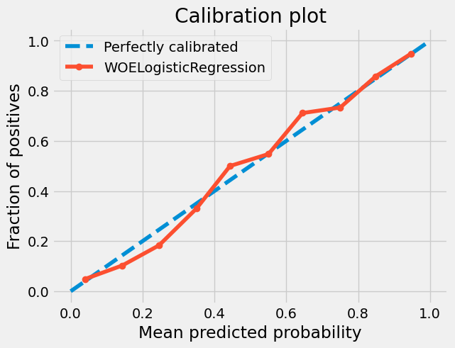

## Model Train Metrics
{
    "ROC AUC Score": 0.8698805394816606,
    "PR AUC Score": 0.7123467967634151,
    "Gini Score": 0.7397610789633211,
    "Kolmogorov-Smirnov Score": 0.6164803829590441
}

## Train Calibration Plot

## Model Test Metrics
{
    "ROC AUC Score": 0.8716146967317216,
    "PR AUC Score": 0.7183247007294158,
    "Gini Score": 0.7432293934634433,
    "Kolmogorov-Smirnov Score": 0.6121896745267259
}

## Test Calibration Plot

